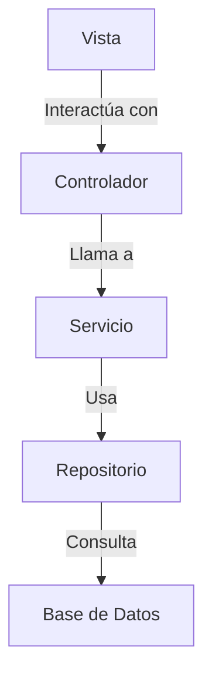

# 🚀 Spring3_tasca3 - Sistema de Gestión de Entidades (EscapeRoom) MVC

Una aplicación Java/Spring que permite gestionar diferentes entidades (certificados, clientes, objetos, etc.) en una base de datos MySQL, siguiendo el patrón MVC y utilizando consultas SQL seguras. El sistema implementa un CRUD completo para varias entidades, optimizando la interacción con la base de datos y garantizando una arquitectura escalable.

---

## 📌 Características Principales

- **CRUD Completo** para 7 entidades diferentes (certificados, clientes, objetos, etc.).
- Implementación del **Patrón MVC** con separación clara de responsabilidades.
- **Conexión a la base de datos** mediante un patrón Singleton.
- **Consultas SQL parametrizadas** para prevenir inyecciones y garantizar la seguridad.
- Ejecutable como **JAR independiente**, fácil de desplegar.
- **Configuración centralizada** a través del archivo `application.properties`.

---

## 🛠 Tecnologías

| Componente        | Versión   |
|-------------------|-----------|
| **Java**          | 23        |
| **MySQL Connector** | 8.0.18  |
| **MySQL Server**   | 8.0+     |
---

## ⚙️ Configuración Inicial

### Requisitos Previos

1. **Java JDK 23** o superior.
2. **MySQL Server 8.x** o superior.
3. **Maven 3.8+**.

### 1. Configuración de la Base de Datos

```sql
CREATE DATABASE escape_room_db;
CREATE USER 'app_user'@'localhost' IDENTIFIED BY 'password';
GRANT ALL PRIVILEGES ON escape_room_db.* TO 'app_user'@'localhost';
FLUSH PRIVILEGES;
```

### 2. Configurar `application.properties`

```properties
# src/main/resources/application.properties
spring.datasource.url=jdbc:mysql://localhost:3306/escape_room_db
spring.datasource.username=app_user
spring.datasource.password=password
spring.jpa.hibernate.ddl-auto=update
```

---

## 🚀 Ejecución del Proyecto

###  Ejecutar JAR Independiente
```bash
java -jar target/Spring3_tasca3-1.0.0.jar
```
---

## 🗂 Estructura del Proyecto

```plaintext
src/
├── main/
│   ├── java/
│   │   └── com/example/spring3_tasca3/
│   │       ├── config/            # Configuraciones de Spring
│   │       ├── controllers/       # Controladores MVC
│   │       ├── models/            # Entidades JPA
│   │       ├── repositories/      # Interfaces de acceso a datos
│   │       ├── services/          # Lógica de negocio
│   │       └── utils/             # Utilidades comunes
│   └── resources/
│       ├── static/                # Recursos estáticos
│       ├── templates/             # Plantillas Thymeleaf
│       ├── application.properties # Configuración
│       └── data.sql               # Datos iniciales
```

---

## 🔄 Ejemplo de Uso: Servicio de Certificados

### Crear nuevo certificado

```java
// Crear nuevo certificado
Certificate cert = new Certificate("Mejor Jugador", "Completar sala en 5min", true, 15);
certificateService.addCertificate(cert);
```

### Recuperar certificado

```java
// Recuperar certificado
Certificate retrievedCert = certificateService.getCertificate(1);
System.out.println(retrievedCert.getName()); // "Mejor Jugador"
```

---

## 🛡 Buenas Prácticas Implementadas

- **Principios Solid**: division de responasbilidades.
- **Implementacion de Patrones**: MVC,Singeltone,builder;
- **Programaion en ingles**:Todos los variables estan en ingles.
- **Manejo de Excepciones**:Control de entradas del usuario.

---

## 📊 Diagrama de Componentes



---

## 🤝 Contribución

1. Haz fork del repositorio.
2. Crea una rama: `git checkout -b feature/nueva-funcionalidad`.
3. Realiza tus cambios y realiza commit: `git commit -m 'Add some feature'`.
4. Push a la rama: `git push origin feature/nueva-funcionalidad`.
5. Abre un Pull Request.

## 🦸 Autores
Antonio Carrasco, Angel Pelaez, Jofre Coca.
---


## 🚨 Notas Importantes

- Este proyecto es ideal para aprender  MVC, JPA, y la gestión segura de bases de datos.
- El patrón de diseño MVC asegura que las funcionalidades estén bien organizadas y escalables.
- La integración con MySQL proporciona una base de datos robusta y flexible para almacenar las entidades gestionadas.

